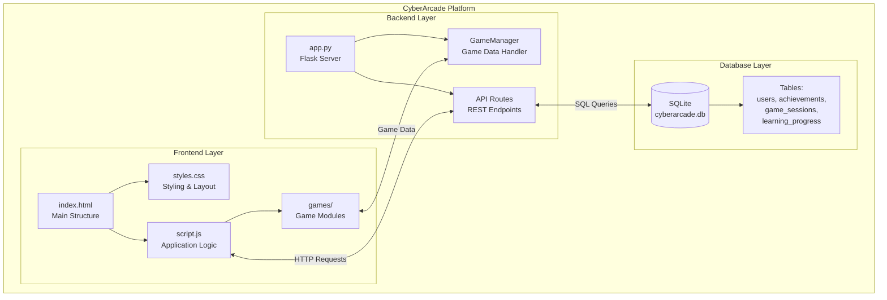
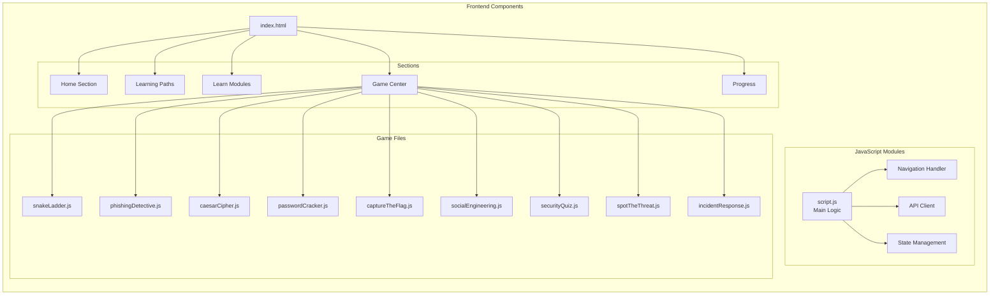
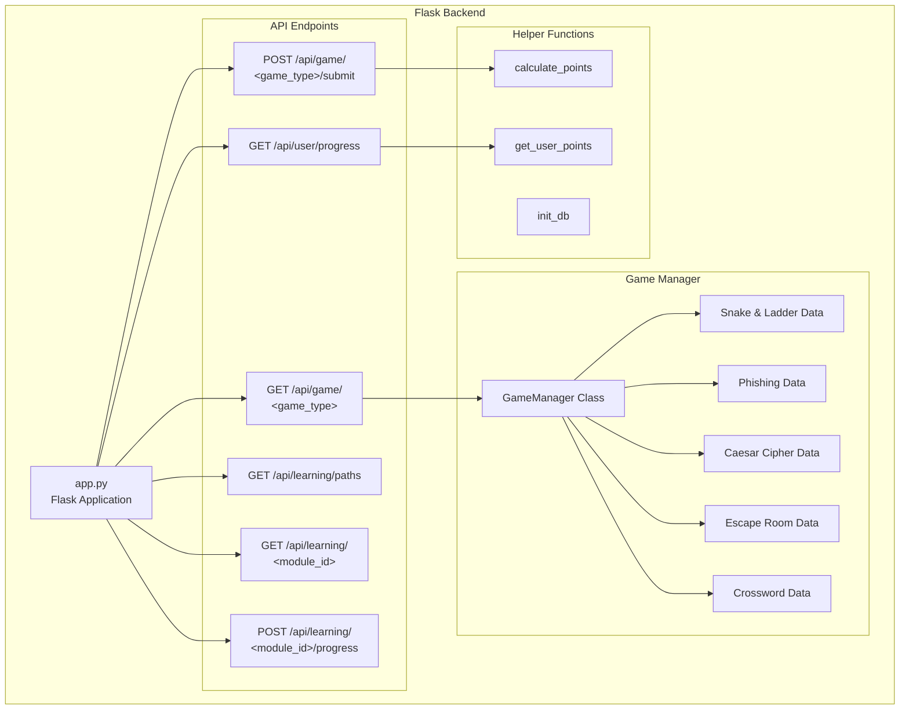
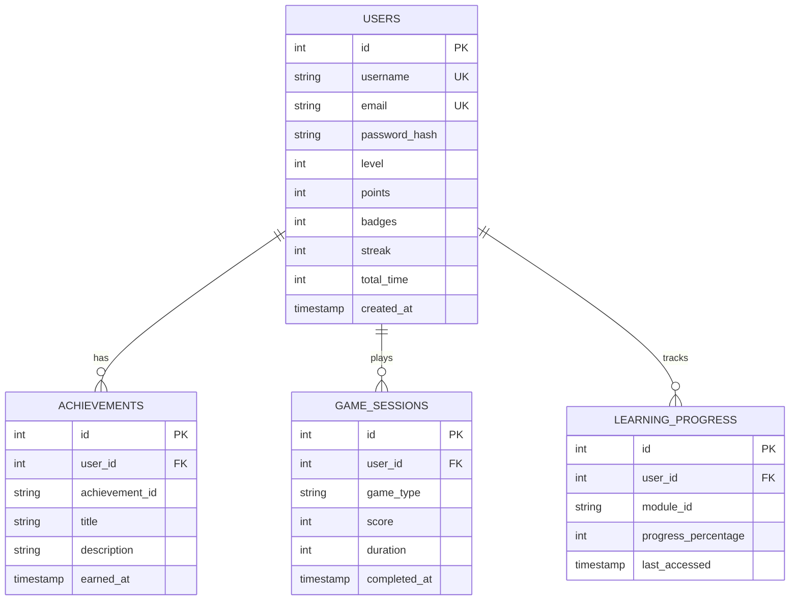
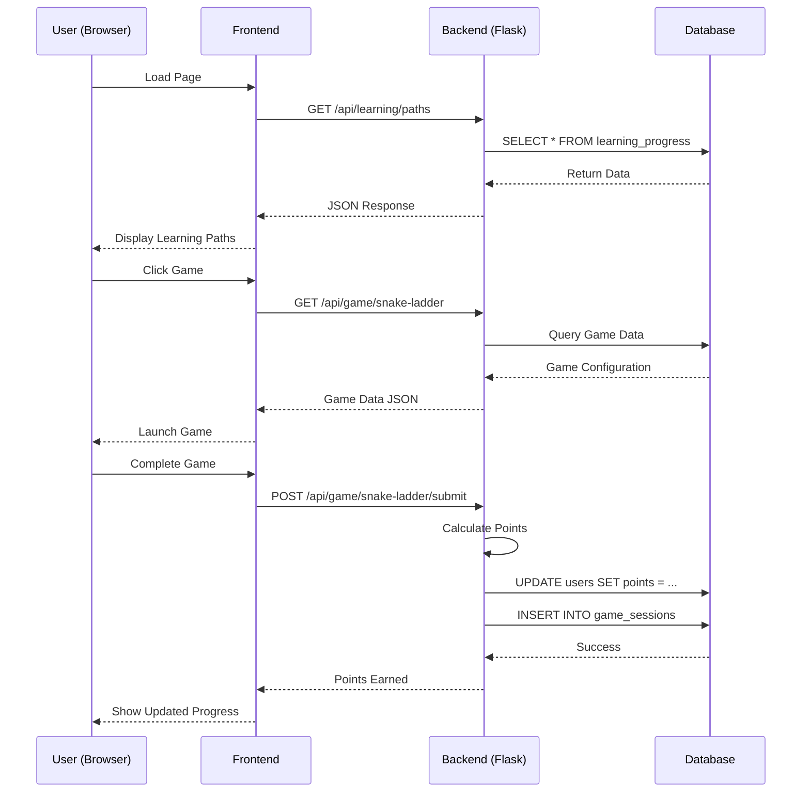
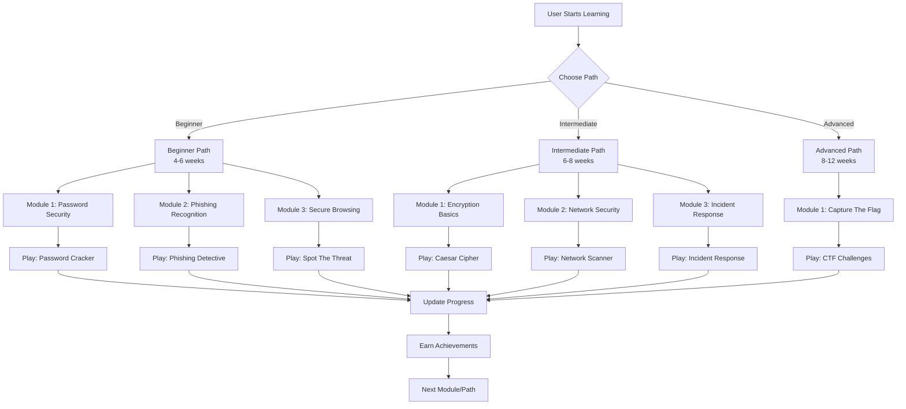
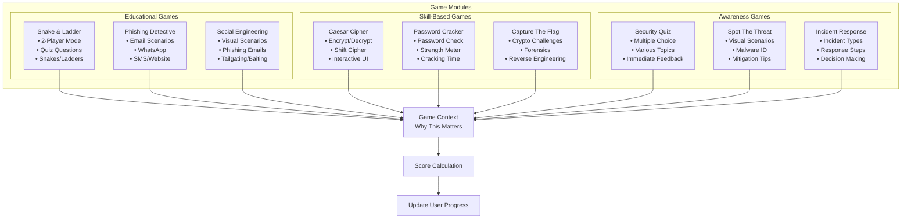
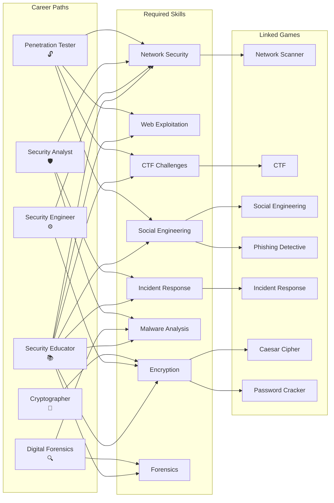
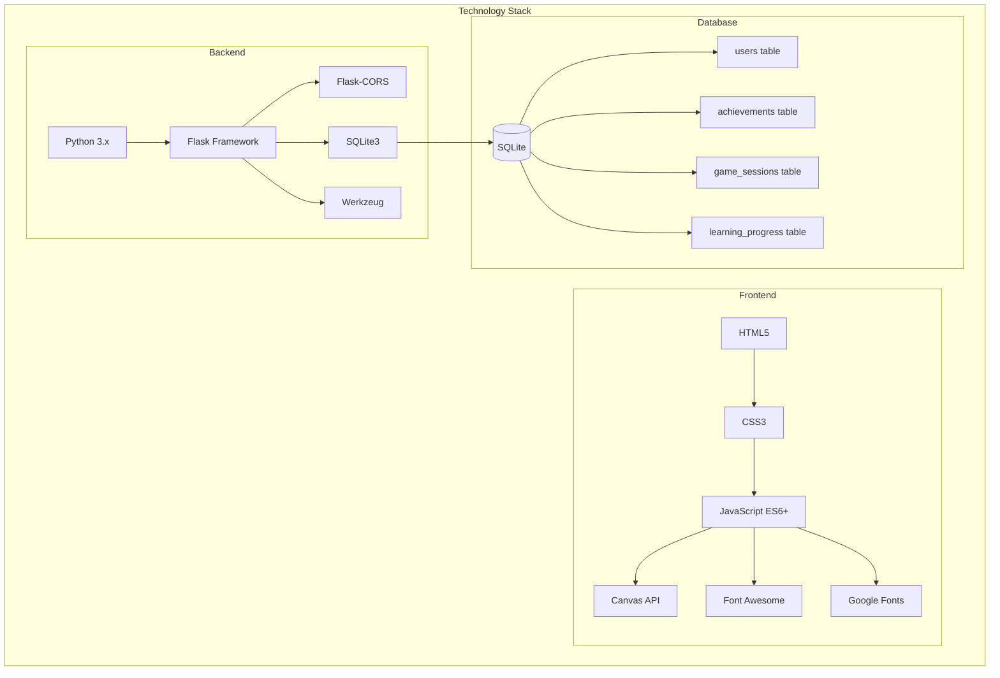

# CyberArcade - Visual Block Diagram (Mermaid)

## System Architecture

## Frontend Components

## Backend API Structure

## Database Schema

## Data Flow

## Learning Paths Flow

## Game Module Architecture

## Career Roadmap Structure

## Technology Stack

---

*This Mermaid diagram can be rendered in GitHub, VS Code with Mermaid extension, or online Mermaid editors.*

